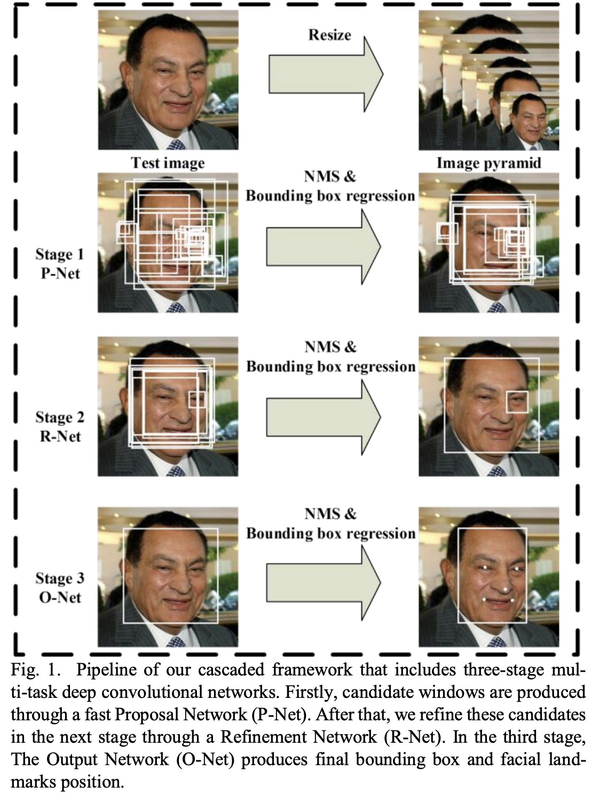
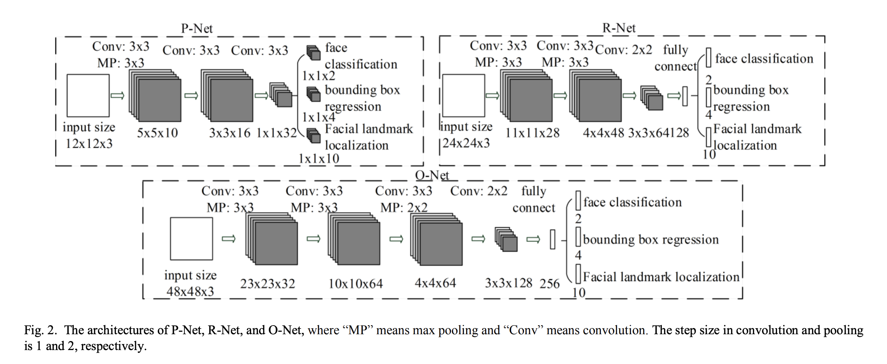
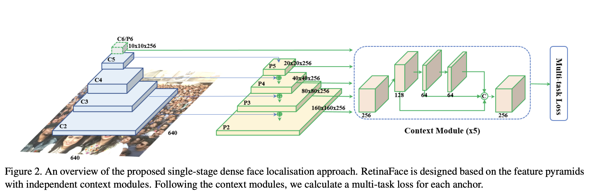
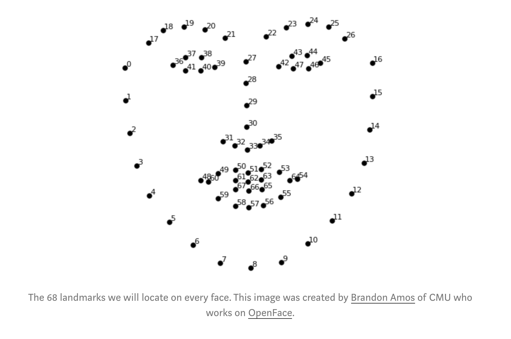

# Smart Doorbell: w251-final-project

## Idea ##

## Data Pipeline ##

* Leverage data streams coming off a smart doorbell like the ring
* Upload images for parts of the video when there is motion 
* Run it through a model that recognizes people in your family in images and possibly classify the object that is moving (ie cat vs car vs delivery guy)
* Only alert the homeowner when there is motion they care about and possibly classify them. 
 
We plan to leverage a large part of HW3. We can optionally replace opencv Haar cascade filters with a pre-trained CNN such as mtcnn.

Once the image is classified, we will put it in the pipeline for post processing. 

* Figure out if we want to include it in our project
* Get the container bindings figured out
* Run in Jupyter to experiment with sample images

## Implementation ##

### Face Detection ###

The first step in our pipeline is face detection.

In this step, we use a video reader such as __cv2__ or __mmcv__ to split the input video into constituent frames. Each frame is then passed through a face detector to check for the presence of people in the image. Initially, we used __Haar cascade classifier__ available as part of OpenCV [2] to detect faces. The Haar classifier is machine learnt model that is build using a large number of micro-features, such as edges and corners, and trained with positive and negative class examples. The OpenCV implementation is trained using __Adaboost__. [XXX: Add info on fps with Haar]. However, the Haar classifier is not a neural network.

Next, we used a CNN based face detector called __MTCNN__ (multi-tasked CNN) [3]. This model uses a cascade of 3 CNNs that are called the Proposal Net (P-net), Refine Net (R-net) and Output Net (O-net). Each CNN is trained using a different loss function - a face/no-face log loss for P-net, bounding box L2 loss for R-net and facial landmark L2 loss for O-net. 

We noticed that sometimes MTCNN was not able to to identify a face in an image. After consultation with the course faculty, we decided to give __RetinaFace__ a try. This is a CNN based model that came out in early 2019 and is documented in the paper, RetinaFace: Single-stage Dense Face Localisation in the Wild [4]. This is a single-shot pixel-wise technique that attemps to simultaeously maximize many learning objectives including face score, face box, five facial features etc. This is not yet available through pip, we we have to copy over a pytorch implementation we found online. We found that this model runs extremely slow on CPU, but once offloaded to the GPU, it ran very efficiently. Also compared to MTCNN, it is indeed much better at extractly faces. In some test videos where MTCNN was not able to extract any faces, RetinaFace was able to detect faces in 73 out of 300 frames.

### Face Identification ###

In order to identify known people we use the computer vision task of person identification. We are all familiar with person identification, even though we may not be aware of it. Facebook is often able to tag your friends automatically once you have tagged them a few times in pictures. Similar features are present in photo upload sites such as Amazon Prime photos and Google photos.

After a face detector such as MTCNN or RetinaFace has identified a face, the cropped image of the face is sent to the person identification model. The person identification model is trained to identify 68 facial landmark features.

Once these 68 points are identified in an image, the image is processed through a series of simple affine transformations that center the features. This is needed since the face in the original image may be oriented in any arbitrary direction.

Next, in order to compare faces, a deep CNN is trained to extract the above mentioned features from a set of 3 images, 2 of which belong to the same person (image0 and image1), and the third (image2) to a similar looking but different person. The network is trained to maximize the likelihood of predicting image0 and image1 to be the same, and image2 to not be the same. This task requires a lot of training data. OpenFace has made a number of trained models available online, and we used a pre-trained model for our project.

The OpenFace pretrained model can be used through the __face recognition__ python package, which in turn requires __cmake__ and __dlib__. The model provides a __face_encodings()__ API that returns a vector of 128 floats that encodes the input face. It also provides a __compare_faces()__ API that takes in a list of known encodings and the encoding of an unknown face, and returns a list with the index of the matching face marked __True__ if a match is found.
In our implementation, pictures of known people are located in an S3 folder, __/s3bucket/knowns__. Each image is named with the person whose picture it is. Our code loads the images on startup and stores the names and their encodings in a dictionary. When an image is analyzed, we compare the face cropped from the image and compare it to the encodings of known people using the compare_faces() API mentioned earlier. A notification is sent if a known person is found, else, the entire frame as well as the cropped frame is stores in the S3 bucket for further analysis.

### New Person Identification ###

### Image Captioning ###

During the project review, we were given feedback about exploring the ability to detect more complicated things, such as a person delivering a package. We will experiment with image captioning pre-trained models for this:

https://www.tensorflow.org/tutorials/text/image_captioning#download_and_prepare_the_ms-coco_dataset

The smart doorbell collects videos and uploads them to the cloud if the on device model indicates that an unknown person is at the door. In our data pipeline, the Facial Detection module receives the video stream, and splits the video stream into frames and uses a face detection model to look for faces in the stream of faces. Once the frames are compared with the library of known faces/people, we have a sequence of frames in the case we have an unrecognized person. An additional piece of ‘smartness’ we want to add to our project is the ability to inform the owner about the activity that the unknown person above is doing. For e.g. the unknown person could be the mailman, and he may be dropping off mail. More interestingly, the unknown person could be a thief and he may be stealing a package that was left at the door. The latter represents a growing problem with the increasing use of online shopping. 

According to an assessment done by security.org, 8 out of 10 American adults are online shoppers, and Americans spend close to $600B on online shopping. The same study reports that 38% of their survey respondents report being victims of package theft. This fact is also reflected empirically in our own neighborhoods. Everyday, platforms such as Nextdoor, people complain about package thefts. In many cases, people have managed to capture images of the perpetrators in the act. However, perps often know where cameras or surveillance equipment is installed, and avoid a direct view of their faces through the use of hoodies, scarves etc.

In light of the above, our solution addresses this issue by attempting to identify the act of theft instead of trying to identify or capture images of the thief. When such an act is detected, a notification is sent in real time to the homeowner, who can take immediate action.

The essence of the activity detection is an image captioning model. The idea of image captioning is simple - it combines the computer vision task of object detection with an NLP text generation model that is trained to label the objects identified in the image. The idea is explained in the paper, Show, Attend and Tell: Neural Image Caption Generation with Visual Attention [1].

The paper describes the construction of the model:

### Additional Investigation: Person Re-Identification ###

Task 1: Person re-identification task (https://github.com/KaiyangZhou/deep-person-reid). Here, the idea is that our image stream should be able to identify a set of known faces.
 
Task 2: We will also use person re-identification to setup an alarm trigger if a person not known to us is detected by our stream for 30+ seconds.

The model listed above is in PyTorch.

https://medium.com/@niruhan/a-practical-guide-to-person-re-identification-using-alignedreid-7683222da644

https://github.com/zlmzju/part_reid/blob/master/demo/demo.ipynb

Note: I found another repo with much better documentation and a seemingly better model

https://github.com/layumi/Person_reID_baseline_pytorch

Here is a good summary of the person re-id task:

"Person re-ID can be viewed as an image retrieval problem. Given one query image in Camera A, we need to find the images of the same person in other Cameras. The key of the person re-ID is to find a discriminative representation of the person."

So, if we have multiple cameras, then given an image from camera A, we want to know which images from cameras B, C, D, ... contain the same person. The initial image is called the query image, and the model outputs a gallery that is a collection of images. This is mostly useful when we cannot do reliable face detection (image is from a distance etc).

I was able to download the market1501 dataset, and train a ResNet50 model and also run a test iteration using the instructions from this site. The next goals would be:

## References ##

[1] https://arxiv.org/pdf/1502.03044.pdf

[2] https://docs.opencv.org/3.4/db/d28/tutorial_cascade_classifier.html

[3] https://arxiv.org/abs/1604.02878

[4] https://arxiv.org/pdf/1905.00641.pdf
